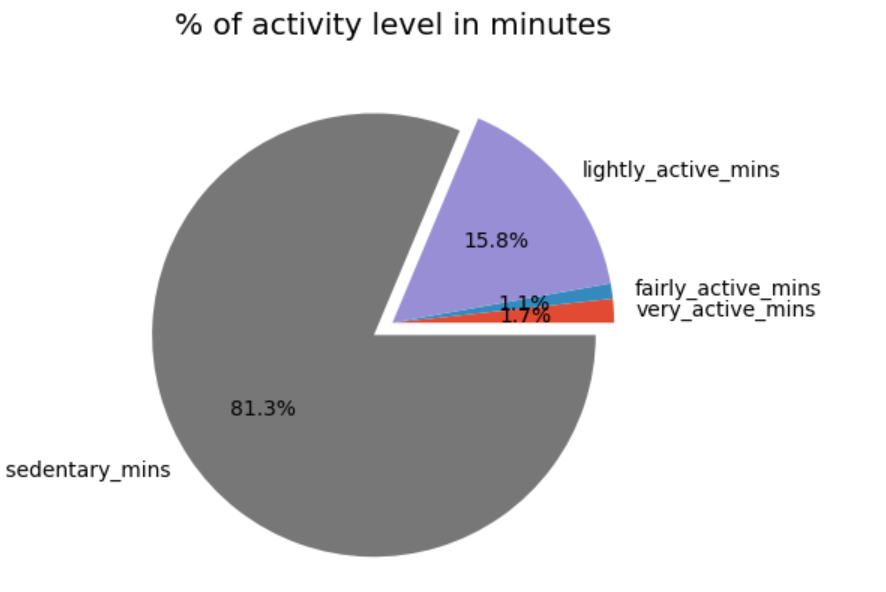
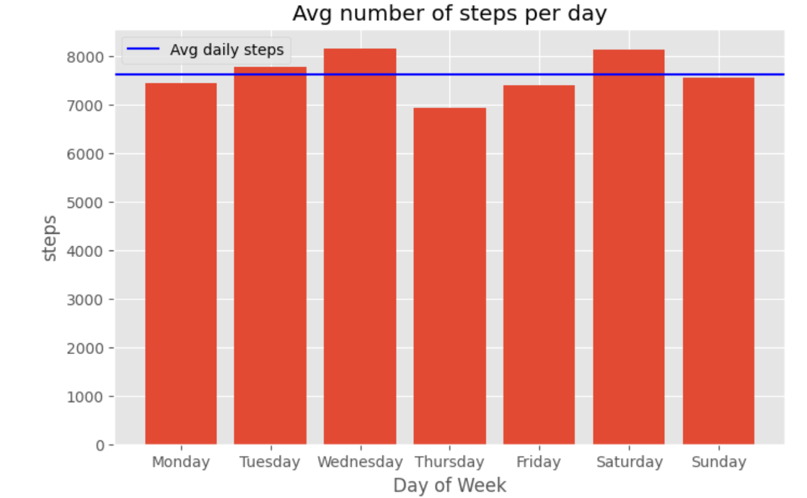
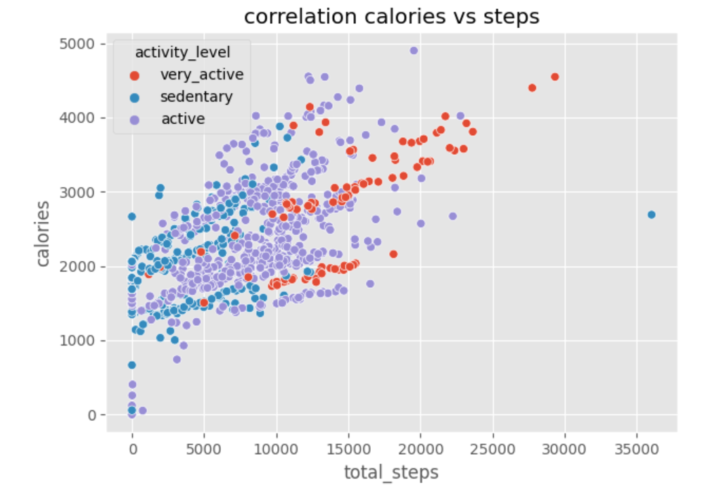

# google-capstone-fitbit

# Google Data Analytics Capstone Project: Fitbit Fitness Tracker Data

This is my capstone project for the Google Data Analytics Certification. I analyzed Fitbit fitness tracker data to gain insights into user activity, behavior, and engagement.

## 📌 Case Study: 
**How Can a Wellness Technology Company Play It Smart?**

## 🧠 Objective:
The goal of this case study was to analyze usage data from Fitbit users and derive actionable insights that can help improve customer engagement, product features, and wellness strategies.

## 📁 Dataset:
The dataset used in this analysis was provided by Fitbit and made available on Kaggle. It contains anonymized fitness data from 30 users tracked over a period of 31 days.

## 🛠 Tools & Skills Used:
- Python (Pandas, NumPy, Matplotlib, Seaborn)
- Data Cleaning & Manipulation
- Exploratory Data Analysis (EDA)
- Data Visualization
- Jupyter Notebook
- Git & GitHub

## 📊 Key Insights:
- Categorized users based on their daily step counts into **sedentary**, **active**, and **very active**.
- Explored correlations between **steps taken** and **calories burned**.
- Analyzed usage patterns across different days of the week.
- Calculated percentage breakdown of active minutes (very/fairly/lightly/sedentary).

  ## 📈 Visualizations:

Here are some key visualizations from the analysis:

  
*Percentage of total minutes spent in different activity levels (very active, fairly active, lightly active, sedentary).*

  
*Average number of steps taken each day of the week.*

  
*Relationship between activity minutes and calories burned.*

  
*Steps taken categorized by activity level.*

---

## 💡 Business Recommendations:

Based on the insights from this data, the following strategies are recommended:

- Provide tailored activity goals based on individual usage patterns.
- Introduce gamified challenges for users who are in the sedentary category to boost activity levels.
- Promote healthy weekday habits by encouraging users to maintain consistency across the week.
- Offer real-time feedback and motivational nudges based on calorie burn and step targets.

 
